# Mern-stack-demo
devops demo

In this demo, I will write a  mern stack web-app from the very beginning. You will learn REST API crud and mongodb basic database operation and postman to test APIs and hopefully you will have a clear architecture of dynamic websites functions.

## MERN Definition

- M stands for MongoDB

  - A NoSQL, document-oriented database that uses JSON-like documents with optional schemas.

- E stands for Express.js

  - A minimal and flexible Node.js web application framework that provides a robust set of features for web and mobile applications.

- R stands for React

  - A JavaScript library for building user interfaces, particularly single-page applications with reusable UI components.

- N stands for Node.js
  
  - A JavaScript runtime environment that executes JavaScript code outside a web browser, enabling server-side development.

## MERN architecture

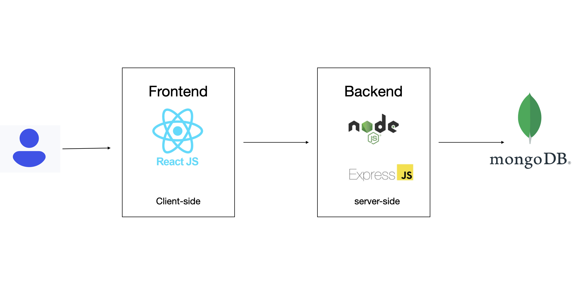

## Usage
- Initialize a Node JS applicaton
```shell
npm init -y
```
- Install express
```shell
npm install express@4.18.2
```
- Create server.js file
```shell
touch server.js
```
- Run the server
```shell
node server.js
```
- If you want to run dev like "npm run dev", you need to modify the package.json file 
from 
```shell
"scripts": {
    "test": "echo \"Error: no test specified\" && exit 1"
  },
  ```
  to
  ```
  "scripts": {
    "dev": "nodemon server.js"
  },
  ```
- Remember that package.json file is in Backend folder, so you should go to backend directory to do that

- Install nodemon so that the server can refresh automatically
```shell
npm install nodemon -D
```
- then you also need to modify the package.json scripts and changed to nodemon
```shell
"scripts": {
    "dev": "nodemon server.js"
  },
```
- you can see the server now is running using nodemon
```shell
pengchaoma@pengchaos-MacBook-Pro backend % npm run dev

> backend@1.0.0 dev
> nodemon server.js

[nodemon] 3.1.11
[nodemon] to restart at any time, enter `rs`
[nodemon] watching path(s): *.*
[nodemon] watching extensions: js,mjs,cjs,json
[nodemon] starting `node server.js`
Server is running on port 5001
```
- Add the start command in package.json scripts
```shell
"scripts": {
    "dev": "nodemon server.js",
    "start": "node server.js"
  },
```
- Install mongodb using docker-compose
```shell
version: '3.8'

services:
  mongodb:
    image: mongo:latest
    container_name: mongodb
    restart: unless-stopped
    ports:
      - "27017:27017"
    environment:
      MONGO_INITDB_ROOT_USERNAME: admin
      MONGO_INITDB_ROOT_PASSWORD: secret
      MONGO_INITDB_DATABASE: mydatabase
    volumes:
      - ./mongodb/data:/data/db
      - ./mongodb/init:/docker-entrypoint-initdb.d  # initialization script directory
      - ./mongodb/config:/data/configdb
    # Enable authentication (recommended for production environments)
    command: ["--auth"]
```
- Run the docker-compose command
```shell
docker-compose up -d
```
- Install mongoose
```shell
npm install mongoose@7.0.3
```
- Install dotenv in backent directory
```shell
npm install dotenv
```
- Connect mongodb using docker-compose
```shell
docker-compose exec mongodb mongosh
```
- type the authentication information
  - switch to admin database for auth
  ```shell
    use admin
  ```
 - credential verification
   ```shell
   db.auth("admin", "secret")
   ```
 - when result return 1 that means successfully login
   like this
   ```shell
   admin> db.auth("admin", "secret")
    { ok: 1 }
   ```
- check the databases in mongodb
  ```shell
  admin> show dbs
  admin   100.00 KiB
  config   12.00 KiB
  local    72.00 KiB
  ```
- Health check function postman test

  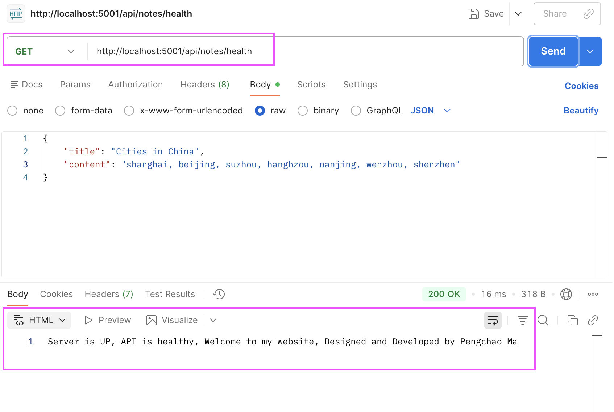

- getNotes function and use postman to have a test
 
  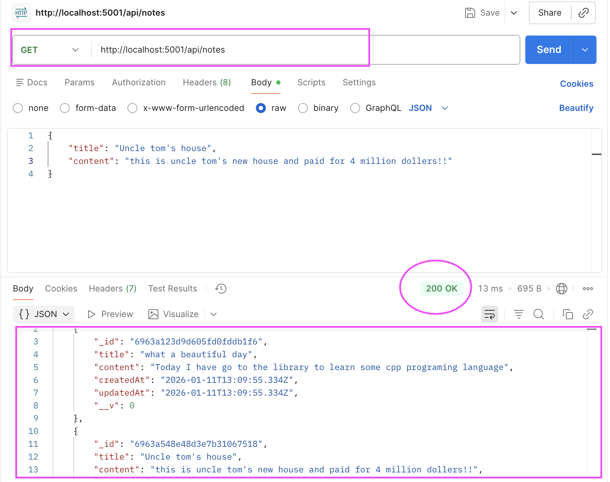

- create function and use postman to have a test

  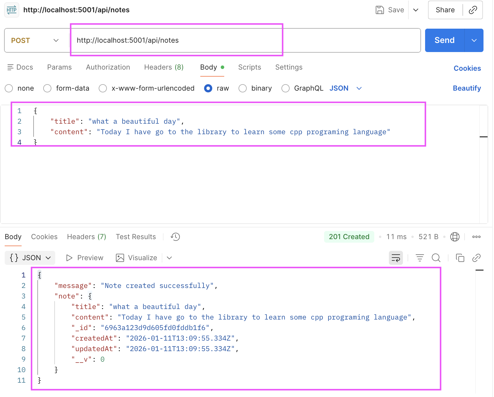

- Go to mongodb to check the data
  ```shell
  admin> show dbs
  admin       100.00 KiB
  config      108.00 KiB
  local        64.00 KiB
  mydatabase   40.00 KiB 
  ```
- Switch to mydatabase
  ```shell
  use mydatabase
  ```
- Check the collection
  ```shell
  mydatabase> show collections
  notes
  ```
- Check all the Documents in notes collection
  ```shell
  db.notes.find()
  ```
  - then you can find all the documents like this
  ```shell
  [
  {
    _id: ObjectId('6963a123d9d605fd0fddb1f6'),
    title: 'what a beautiful day',
    content: 'Today I have go to the library to learn some cpp programing language',
    createdAt: ISODate('2026-01-11T13:09:55.334Z'),
    updatedAt: ISODate('2026-01-11T13:09:55.334Z'),
    __v: 0
  },
  {
    _id: ObjectId('6963a548e48d3e7b31067518'),
    title: "Uncle tom's house",
    content: "this is uncle tom's new house and paid for 4 million dollers!!",
    createdAt: ISODate('2026-01-11T13:27:36.826Z'),
    updatedAt: ISODate('2026-01-11T13:27:36.826Z'),
    __v: 0
  }
  ]

  ```
- Now we test updateNotes function
  - before we update

  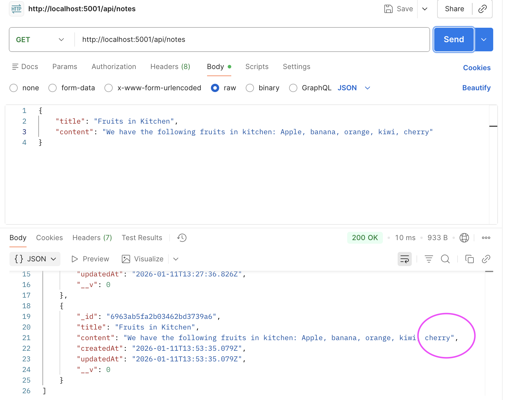

  - Execute update with ID

  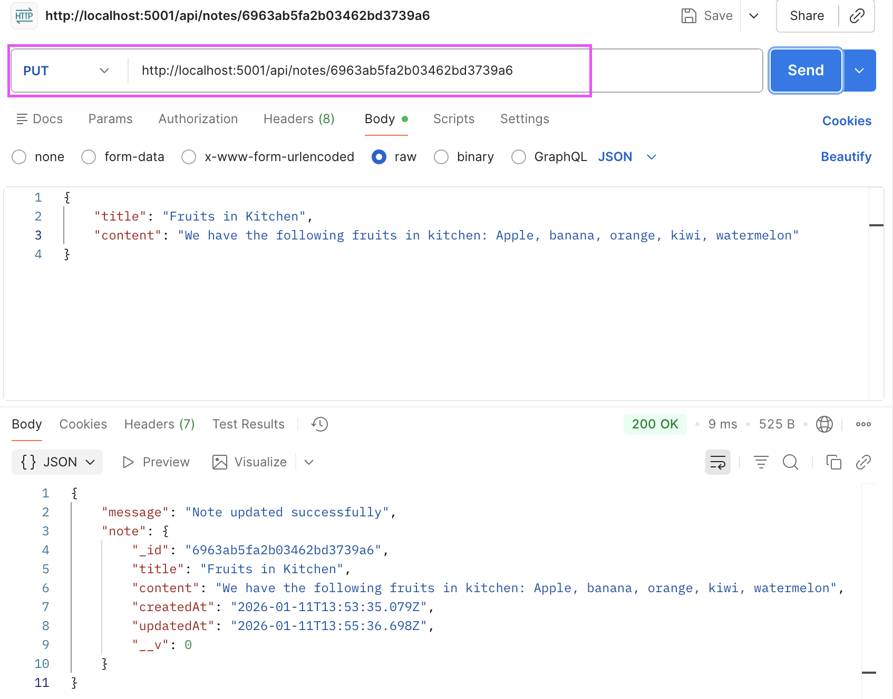

  - Check the update result

  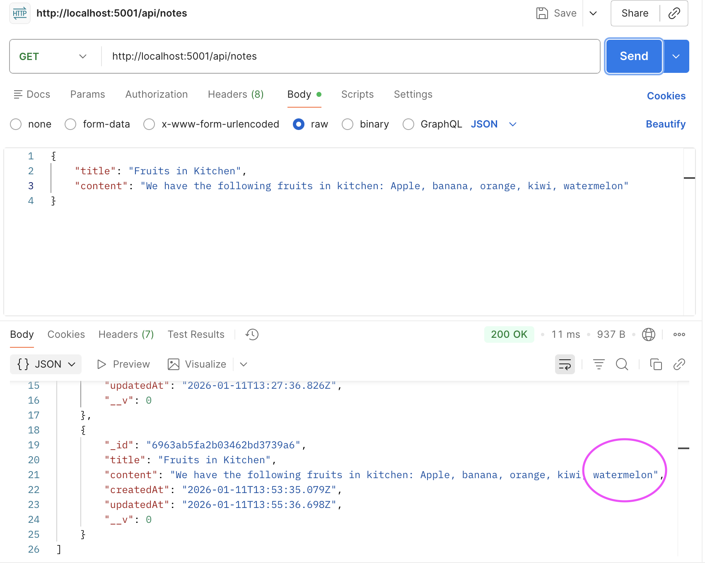

- If the ID is wrong then we will get the error and notes not found

  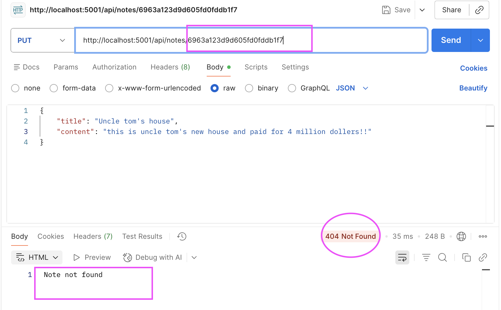

- deleteNotes function test

  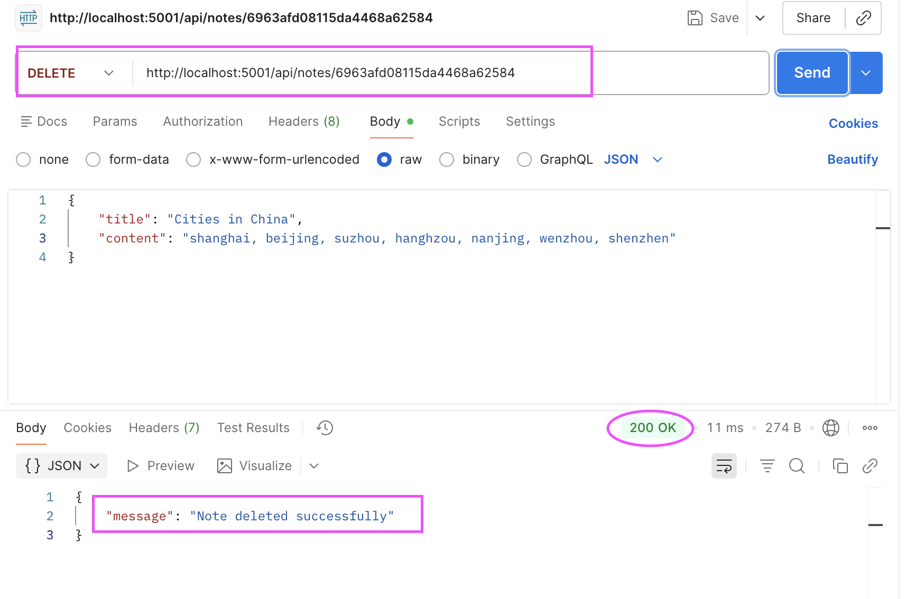

- I also added getNoteByID function which can filter with ID number

  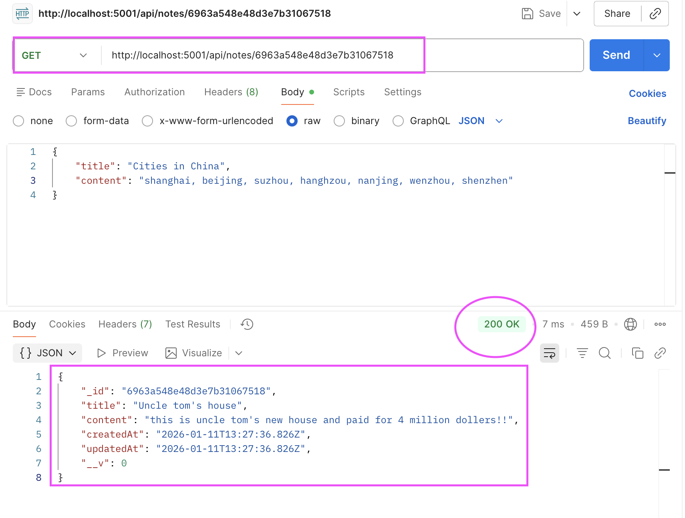

## Middleware Rate Limitting Redis

- We need to install Redis to prevent the server from overloading and crashing due to too many requests in a short period of time.

- Install redis using docker-compose 
```shell
docker-compose up -d
```
- Check the Redis container status
```shell
pengchaoma@pengchaos-MacBook-Pro Redis % docker-compose ps
NAME            IMAGE                           COMMAND                  SERVICE         CREATED          STATUS                    PORTS
redis-insight   redislabs/redisinsight:latest   "./docker-entry.sh n…"   redis-insight   24 seconds ago   Up 13 seconds             0.0.0.0:8001->8001/tcp, [::]:8001->8001/tcp
redis-server    redis:7.0-alpine                "docker-entrypoint.s…"   redis           24 seconds ago   Up 24 seconds (healthy)   0.0.0.0:6379->6379/tcp, [::]:6379->6379/tcp, 0.0.0.0:8002->8001/tcp, [::]:8002->8001/tcp

```
- login to Redis to have a check
```shell
docker-compose exec redis redis-cli -a redis123
```
127.0.0.1:6379> keys *
(empty array)
```
- Install necessary plugins
```shell
npm install express-rate-limit rate-limit-redis ioredis
```
- Test results of too many requests in a short period of time
Redis acts as a centralized counter in rate limiting, which is key to implementing rate limiting across requests, servers, and time periods.

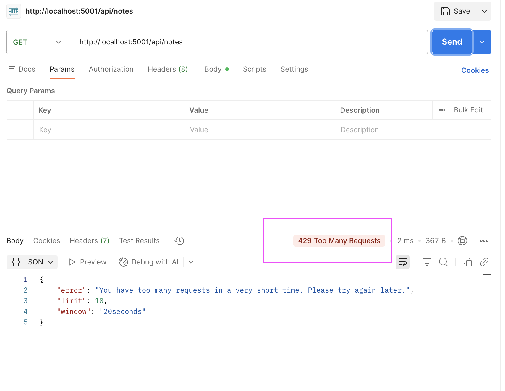

- I can also use shell script to have a test
```shell
pengchaoma@pengchaos-MacBook-Pro ~ % for i in {1..15}; do
  echo -n "Request $i: "
  curl -s http://localhost:5001/api/notes 2>/dev/null | head -c 50
  echo ""
  sleep 0.1
done

Request 1: [{"_id":"69645a38d96eb9feac7a1b17","title":"Animal
Request 2: [{"_id":"69645a38d96eb9feac7a1b17","title":"Animal
Request 3: [{"_id":"69645a38d96eb9feac7a1b17","title":"Animal
Request 4: [{"_id":"69645a38d96eb9feac7a1b17","title":"Animal
Request 5: [{"_id":"69645a38d96eb9feac7a1b17","title":"Animal
Request 6: [{"_id":"69645a38d96eb9feac7a1b17","title":"Animal
Request 7: [{"_id":"69645a38d96eb9feac7a1b17","title":"Animal
Request 8: [{"_id":"69645a38d96eb9feac7a1b17","title":"Animal
Request 9: [{"_id":"69645a38d96eb9feac7a1b17","title":"Animal
Request 10: [{"_id":"69645a38d96eb9feac7a1b17","title":"Animal
Request 11: {"error":"You have too many requests in a very sho
Request 12: {"error":"You have too many requests in a very sho
Request 13: {"error":"You have too many requests in a very sho
Request 14: {"error":"You have too many requests in a very sho
Request 15: {"error":"You have too many requests in a very sho
```
- then go to redis you can see the ratelimit key
```shell
127.0.0.1:6379> keys ratelimit:*
1) "ratelimit:::1"

```
- check the TTL of the key
```shell
127.0.0.1:6379> TTL "ratelimit:::1"
(integer) -2
```
## Fronted vite React application

- go to the backend folder and create a vite React application
```shell
npm create vite@latest .
```
- select React framework
```shell
Select a framework:
│  ○ Vanilla
│  ○ Vue
│  ● React
│  ○ Preact
│  ○ Lit
│  ○ Svelte
│  ○ Solid
│  ○ Qwik
│  ○ Angular
│  ○ Marko
│  ○ Others
```
- select JavaScript
```shell
Select a variant:
│  ○ TypeScript
│  ○ TypeScript + React Compiler
│  ○ TypeScript + SWC
│  ● JavaScript
│  ○ JavaScript + React Compiler
│  ○ JavaScript + SWC
│  ○ React Router v7 ↗
│  ○ TanStack Router ↗
│  ○ RedwoodSDK ↗
│  ○ RSC ↗
│  ○ Vike ↗
```
- when you type npm run dev you should see the vite + React page from http://localhost:5173/

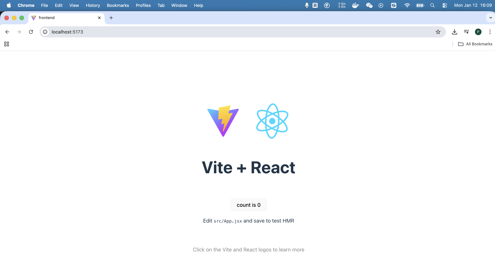

- Install React router dom
```shell
npm install react-router-dom@6.20.0
```
- Install react hot toast
```shell
npm install react-hot-toast
```
- Install ES7 React/Redux/GraphQL/React-Native snippets for vscode

- Here is the website running looks like

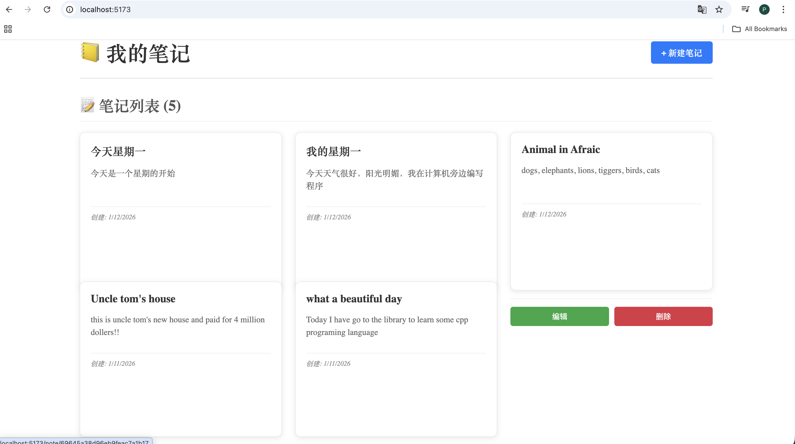


